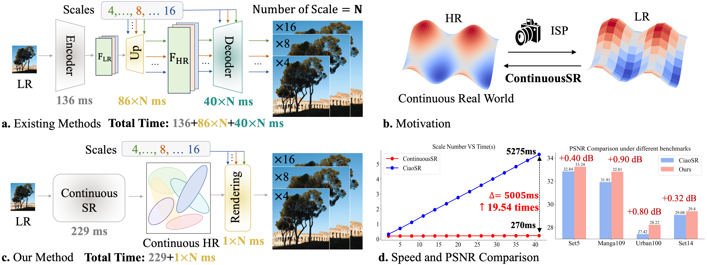

##  💡 Summary
We introduce **ContinuousSR**, a novel Pixel-to-Gaussian paradigm designed for fast and high-quality arbitrary-scale super-resolution. By explicitly reconstructing 2D continuous HR signals from LR images using Gaussian Splatting, **ContinuousSR** significantly improves both efficiency and performance. Through statistical analysis, we uncover the Deep Gaussian Prior (DGP) and propose a DGP-driven Covariance Weighting mechanism along with an Adaptive Position Drifting strategy. These innovations improve the quality and fidelity of the reconstructed Gaussian fields. Experiments on seven popular benchmarks demonstrate that our method outperforms state-of-the-art methods in both quality and speed, achieving a {19.5×} speed improvement and {0.90dB} PSNR improvement, making it a promising solution for ASSR tasks.

## 💡 Motivation and Framework
&nbsp;
Compared to other methods, the proposed ContinuousSR delivers significant improvements in SR quality across all scales, with an impressive 19.5× speedup when continuously upsampling an image across forty scales.


### 📃 Dependencies and Installation
- python=3.9
- pytorch=1.13
- basicsr==1.3.4.9
- Others:
```bash
git clone https://github.com/XingtongGe/gsplat.git
cd gsplat
pip install -e .[dev]
```

## Get Started
### Pretrained model
- After our thorough reproduction process, we are excited to **open-source** the pre-trained model!  
- The **best-performing version** of our method can be downloaded here:  ➡️ [Pretrained Model](https://drive.google.com/file/d/1UKXch2ryl6zZWs9QCgtfWpgVwtYLsxtS/view?usp=drive_link)  
- Once downloaded, place the model in the designated folder, and you’ll be ready to run the demo and perform inference. 🚀  

### Demo
Here is an Demo
```bash
# scale represents the magnification factors for height and width respectively
python demo.py --input butterflyx4.png --model ContinuousSR.pth --scale 4,4 --output output.png
```
### Inference
Here is an example command for inference
```bash
# test Set5 X4
python test.py --config ./configs/test/test-set5-4.yaml --model ContinuousSR.pth
```

## Visual Examples
&nbsp;

## ✉️ License
Licensed under a [Creative Commons Attribution-NonCommercial 4.0 International](https://creativecommons.org/licenses/by-nc/4.0/) for Non-commercial use only.
Any commercial use should get formal permission first.

## ✉️ Acknowledgement
This repository is maintained by [Long Peng](https://peylnog.github.io/) and [Anran Wu](https://github.com/wuanran678).

### Citation

If you are interested in the following work, please cite the following paper.

```
@article{peng2025pixel,
  title={Pixel to Gaussian: Ultra-Fast Continuous Super-Resolution with 2D Gaussian Modeling},
  author={Peng, Long and Wu, Anran and Li, Wenbo and Xia, Peizhe and Dai, Xueyuan and Zhang, Xinjie and Di, Xin and Sun, Haoze and Pei, Renjing and Wang, Yang and others},
  journal={arXiv preprint arXiv:2503.06617},
  year={2025}
}
```

# **ContinuousSR Model Training**

This document provides instructions for training the ContinuousSR (Pixel-to-Gaussian) model using the provided Python scripts.

The main script, train\_full\_project.py (or train\_full.py), is configured to automatically use the correct model backbones and data wrappers for arbitrary-scale super-resolution (ASSR).

## **1\. Project Structure**

Please ensure your project is organized as follows for all imports to work correctly:

/your\_project\_folder  
|  
|-- train\_full.py           \<-- The main training script  
|-- gaussian.py             \<-- The core ContinuousGaussian model file  
|-- utils.py                \<-- Shared utility functions  
|  
|-- models/                 \<-- Python package containing all model backbones  
|   |-- \_\_init\_\_.py         \<-- Registers all models (edsr, mlp, etc.)  
|   |-- models.py  
|   |-- edsr.py  
|   |-- rdn.py  
|   |-- swinir.py  
|   |-- hat.py  
|   |-- mlp.py  
|   |-- cnn.py  
|   |-- unet.py  
|  
|-- datasets/               \<-- Python package containing all data wrappers  
|   |-- \_\_init\_\_.py  
|   |-- datasets.py  
|   |-- image\_folder.py     \<-- Loads full HR images from disk  
|   |-- wrappers.py         \<-- Handles random cropping and downsampling

## **2\. Prerequisites**

### **Environment Setup**

You must have a Python environment with PyTorch and CUDA support.

1. Install PyTorch:  
   (Example for CUDA 11.8. Adjust to your system.)  
   pip install torch torchvision \--index-url \[https://download.pytorch.org/whl/cu118\](https://download.pytorch.org/whl/cu118)

2. Install gsplat Library:  
   The core Gaussian Splatting model requires this CUDA-accelerated library.  
   (Adjust cu118 and torch-2.1.0 to match your PyTorch/CUDA version.)  
   pip install gsplat-cu118 \-f \[https://huggingface.co/quadra-kok/gsplat/whl/torch-2.1.0.html\](https://huggingface.co/quadra-kok/gsplat/whl/torch-2.1.0.html)

3. Install Other Dependencies:  
   The project requires timm, einops, imageio, scikit-image, and tensorboardX.  
   pip install timm einops imageio scikit-image tensorboardX

### **Dataset Setup**

You must download the **DIV2K 800-image training set (HR)**.

1. Download the dataset (e.g., from the [DIV2K homepage](https://data.vision.ee.ethz.ch/cvl/DIV2K/)).  
2. Unzip the file (DIV2K\_train\_HR.zip) to a known location on your machine.  
   * Example path: /home/youruser/datasets/DIV2K\_train\_HR

**Note:** The training script automatically handles cropping. It uses the sr-implicit-downsampled wrapper to perform **random 256x256 HR cropping** and **random-scale downsampling** (between 4x and 8x) on-the-fly, as required for ASSR training.

## **3\. How to Train**

You run the training using the train\_full.py script from your terminal.

The only required argument is \--path to your DIV2K HR folder.

### **Basic Training Command**

python train\_full.py \--path /path/to/your/DIV2K\_train\_HR 

### **Advanced traning command**

```bash
python train_full.py \
    --path /path/to/your/DIV2K_train_HR \
    --dataset_config train-div2k.yaml \
    --epochs 50 \
    --batch_size 2 \
    --lr 5e-5 \
    --num_workers 4 \
    --resume /path/to/your/previous_model.pth 
```


